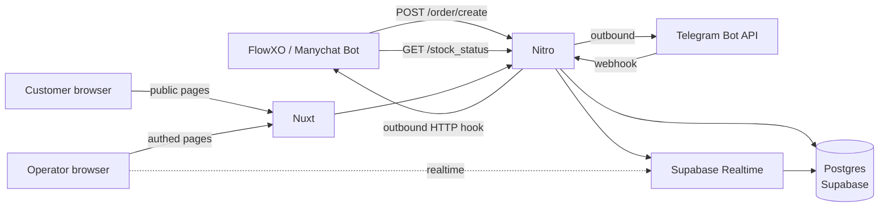

# Jomini BMS v2 — Implementation Plan

> This file is the single source of truth for rebuilding the Jomini Enterprise backend + frontend as one Nuxt 3 app (codename **jomini-bms**). It is written for an AI coding agent to execute top-to-bottom.
>
> **Required reading before touching code:**
>
> 1. `current_backend_implementation.md` — legacy backend.
> 2. `current_frontend_implementation.md` — legacy frontend.
> 3. This file, in full.
> 4. `AGENTS.md` + everything in `.agent/rules/`.
>
> Any conflict between the two legacy docs and this plan is resolved in favour of this plan, **except for §10 (External API Contracts), which is byte-identical to legacy and non-negotiable**.

---

## 1. Executive Summary

- Build one Nuxt 3 app (frontend + Nitro server) backed by Postgres (self-hosted Supabase). Supabase Realtime replaces Firestore's live-order feed.
- Preserve the two chatbot-facing endpoints (`POST /order/create`, `GET /stock_status`) byte-for-byte. Everything else is a ground-up rewrite.
- Drop: Firebase (Auth/Firestore/Storage/Hosting), GAE, Puppeteer home server, Smile.one HTTP automation, Billplz, Manychat, Google Sheets ledger, PWA/Capacitor, Firebase Functions, in-memory dedupe.
- Add: dynamic games/suppliers management with Monaco JSON bulk editor, improved denomination-split engine, in-app reports with CSV export, DB-backed locks, JWT auth with admin-invite flow, revamped operator dashboard, revamped public customer form.
- Deploy: DigitalOcean App Platform, multi-instance capable.

---

## 2. Scope (Keep / Drop)

| Area | Decision |
| --- | --- |
| External contracts `POST /order/create`, `GET /stock_status`, `CustomAuth` header | **Keep byte-identical** |
| Operator live dashboard, process/reject/archive/edit/mark-done/auto-process-link, receipt preview, trust counters (`prevOrderCount`, `prevOrderIdCount`), new-order chime | Keep, redesigned |
| `refund` terminal status | Keep (distinct from `closed`) |
| `priceModifier` visual warning (B11), dev/test buttons (B16), `check_urls` Maybank screenshots (legacy `check_urls` column) | Drop |
| Public customer order form, external tokenised URL generator, 4 MB receipt cap, payment-announcement modal | Keep, UI fully revamped |
| `/bot` FlowXO iframe page (C7) | Drop |
| Games | Dynamic & admin-managed (replaces hard-coded enum). Bootstrap with mlbb, pubg, wr, ff, genshin_impact, hok. |
| Suppliers | Dynamic & admin-managed. Each supplier picks a `relay_channel`: `telegram` (internal/supplier group + manual `/d`, `/f`), `manual` (operator fully manual), or `http_api` (auto-dispatch to the supplier's HTTP API via a pluggable adapter — see §11.4). Bootstrap with `smile_one` (telegram), `backstreet_gamer` (telegram), `nick` (http_api → quinngamingshop), `others` (manual). **Smile.one HTTP automation is not re-added** — the adapter pattern is generic and supports it if/when someone writes an adapter. |
| Smile.one reconciliation (F1/F2/F3) | Drop |
| Billplz / any payment gateway | Drop |
| Manychat notifications (H3) | Drop |
| FlowXO notifications (H4) + Telegram internal & supplier groups + delayed "write review" follow-up + daily summaries | Keep |
| Google Sheets ledger + Maybank balance writer | Drop entirely |
| Firebase Auth / `allowedUser` / presence doc / FirebaseUI | Drop — replaced by custom JWT auth |
| In-process `persistent-store` dedupe | Drop — replaced by DB-backed advisory lock |
| Puppeteer home server | Drop |
| PWA / Capacitor / Android shell | Drop |
| GAE / Firebase Hosting | Drop — deploy to DO App Platform |
| Auto-route-registration by filename (L7) | Drop — use Nuxt/Nitro conventions |
| Custom ANSI logger (L8) | Drop — use Nitro built-in + pino |
| Legacy seed / cleanup scripts (L9) | Drop; replaced by a single `scripts/seed.ts` |

---

## 3. Target Stack

| Layer | Choice |
| --- | --- |
| Framework | Nuxt 3 (Vue 3, `<script setup lang="ts">`) with Nitro server for API routes |
| Language | TypeScript (`strict: true`) |
| Styling | Tailwind CSS 3 (not Bootstrap) — via `@nuxtjs/tailwindcss`. `tailwind-merge` for `twMerge`. |
| UI primitives | `@nuxt/ui` (or `reka-ui` + custom) for accessible dialog/select/dropdown/toast; `lucide-vue-next` for icons |
| Code editor | `monaco-editor` + `monaco-editor-vue3` (for Games/Products JSON bulk editor) |
| State | Pinia (`@pinia/nuxt`) |
| Data / DB | Postgres via **self-hosted Supabase**; SQL migrations managed by **Drizzle ORM** (`drizzle-orm`, `drizzle-kit`). Supabase-js v2 for Realtime only. |
| Realtime | Supabase Realtime Postgres Changes (`order` table) via `@supabase/supabase-js` WebSocket client |
| Validation | `zod` on both server and client |
| Auth | Custom JWT (access + refresh) using `jose`. Cookies only; no bearer headers in the UI. |
| HTTP client | Native `$fetch` from Nuxt/ofetch |
| Dates | `dayjs` with `utc` + `timezone` plugins, default TZ `Asia/Kuala_Lumpur` |
| IDs | `nanoid` (21-char default for PK, custom alphabet for human-readable order IDs) |
| Logging | `pino` + `pino-pretty` in dev |
| Lint/format | ESLint (`@nuxt/eslint`) + Prettier + `husky` + `lint-staged` |
| Tests | `vitest` for unit, `@nuxt/test-utils` for e2e |
| Package manager | `pnpm` |
| Node runtime | Node 20 LTS |
| Hosting | DigitalOcean App Platform (Node service) |

---

## 4. Architecture



- Single Nuxt process serves both SSR pages and Nitro API routes.
- Operator dashboard subscribes to Supabase Realtime for live order changes (replacing Firestore `onSnapshot`).
- Telegram bot webhook and FlowXO reply hook both go through the same Nitro server.

---

## 5. Repository Layout

```
jomini-bms/
├── app.vue
├── nuxt.config.ts
├── tsconfig.json
├── package.json
├── .env.example
├── drizzle.config.ts
├── .agent/ (existing)
├── AGENTS.md (existing)
├── current_backend_implementation.md (existing, reference)
├── current_frontend_implementation.md (existing, reference)
├── implementation_plan.md (this file)
├── public/
│   ├── favicon.ico
│   └── logo.svg
├── assets/
│   ├── css/tailwind.css
│   └── sounds/kaching.mp3
├── components/
│   ├── base/
│   │   ├── Button.vue
│   │   ├── Input.vue
│   │   ├── Select.vue
│   │   ├── Dialog.vue
│   │   ├── Toast.vue
│   │   └── Table.vue
│   ├── order/
│   │   ├── OrderCard.vue
│   │   ├── OrderEditForm.vue
│   │   ├── OrderStatusBadge.vue
│   │   └── OrderReceiptViewer.vue
│   ├── admin/
│   │   ├── GamesEditor.vue
│   │   ├── SuppliersEditor.vue
│   │   ├── ProductsBulkEditor.vue  # Monaco JSON bulk editor
│   │   ├── StockControl.vue
│   │   ├── ExternalUrlCreator.vue
│   │   ├── ManualOrderForm.vue
│   │   ├── PaymentAnnouncementForm.vue
│   │   └── UserInviteForm.vue
│   ├── customer/
│   │   ├── CustomerOrderForm.vue
│   │   └── CustomerSuccessScreen.vue
│   ├── reports/
│   │   ├── SalesOverview.vue
│   │   ├── SalesChart.vue
│   │   ├── CsvDownloadButton.vue
│   │   └── ReportFilters.vue
│   └── layout/
│       ├── TopBar.vue
│       └── BottomNav.vue
├── composables/
│   ├── useAuthUser.ts
│   ├── useOrdersRealtime.ts
│   ├── useSalesSummary.ts
│   ├── useDenominationPreview.ts
│   └── useI18n.ts        # wrapper over @nuxtjs/i18n
├── layouts/
│   ├── default.vue       # operator shell (top bar + nav)
│   ├── public.vue        # unauthenticated customer shell
│   └── auth.vue          # login layout
├── pages/
│   ├── index.vue         # redirect: authed -> /orders, guest -> /login
│   ├── login.vue
│   ├── orders/
│   │   ├── index.vue            # live dashboard
│   │   └── [id].vue             # /orders/:id  (replaces /auto_process?orderId=)
│   ├── reports/
│   │   └── index.vue
│   ├── admin/
│   │   ├── index.vue            # landing with section tiles
│   │   ├── games.vue
│   │   ├── suppliers.vue
│   │   ├── products.vue         # Monaco bulk editor
│   │   ├── stock.vue
│   │   ├── external-urls.vue
│   │   ├── announcements.vue
│   │   ├── manual-order.vue
│   │   └── users.vue
│   ├── account.vue
│   ├── external-order/
│   │   └── [externalId].vue     # public customer form
│   ├── unauthorized.vue
│   └── server-error.vue
├── middleware/
│   ├── auth.global.ts
│   └── admin-only.ts
├── plugins/
│   ├── dayjs.client.ts
│   ├── pinia-persist.client.ts
│   └── supabase.client.ts
├── server/
│   ├── api/
│   │   ├── order/
│   │   │   ├── create.post.ts            # EXTERNAL (locked)
│   │   │   ├── create-external.post.ts
│   │   │   ├── process.post.ts
│   │   │   ├── reject.post.ts
│   │   │   ├── archive.post.ts
│   │   │   ├── archive-all.post.ts
│   │   │   ├── done.post.ts
│   │   │   ├── update.post.ts
│   │   │   └── [id].get.ts
│   │   ├── stock-status.get.ts           # EXTERNAL (locked)
│   │   ├── stock-status.put.ts
│   │   ├── url/
│   │   │   ├── create-external.post.ts
│   │   │   └── verify-external.post.ts
│   │   ├── games/
│   │   │   ├── index.get.ts
│   │   │   ├── index.put.ts              # bulk upsert
│   │   │   └── [key].delete.ts
│   │   ├── suppliers/
│   │   │   ├── index.get.ts
│   │   │   ├── index.put.ts
│   │   │   └── [key].delete.ts
│   │   ├── products/
│   │   │   ├── index.get.ts              # query by game+supplier
│   │   │   └── index.put.ts              # bulk upsert (Monaco editor submit)
│   │   ├── announcement.get.ts
│   │   ├── announcement.put.ts
│   │   ├── reports/
│   │   │   ├── summary.get.ts
│   │   │   └── orders.csv.get.ts
│   │   ├── auth/
│   │   │   ├── login.post.ts
│   │   │   ├── logout.post.ts
│   │   │   ├── refresh.post.ts
│   │   │   ├── me.get.ts
│   │   │   └── invite.post.ts            # admin-only
│   │   ├── users/
│   │   │   ├── index.get.ts
│   │   │   └── [id].patch.ts
│   │   └── webhook/
│   │       ├── telegram.post.ts          # /d, /f commands
│   │       └── supplier/
│   │           └── [supplierKey].post.ts # generic supplier callback (e.g. /api/webhook/supplier/nick)
│   ├── middleware/
│   │   ├── 00.logger.ts
│   │   └── 10.auth.ts
│   ├── services/
│   │   ├── order/
│   │   │   ├── createOrder.ts
│   │   │   ├── processOrder.ts
│   │   │   ├── archiveOrder.ts
│   │   │   ├── editOrder.ts
│   │   │   └── resolveGameId.ts          # regex split per game
│   │   ├── denomination/
│   │   │   ├── splitEngine.ts            # core engine (see §12)
│   │   │   ├── strategies.ts
│   │   │   └── __tests__/
│   │   ├── notify/
│   │   │   ├── telegram.ts
│   │   │   ├── flowxo.ts
│   │   │   ├── scenarios.ts              # ORDER_VERIFIED, ORDER_DONE, etc.
│   │   │   └── dailySummary.ts
│   │   ├── supplier/
│   │   │   ├── relay.ts                  # generic dispatcher: picks adapter by supplier.adapter_key
│   │   │   ├── markOutcome.ts            # /d, /f handlers + adapter-initiated outcomes
│   │   │   ├── pollStatus.ts             # cron tick: polls in-flight http_api orders
│   │   │   └── adapters/
│   │   │       ├── types.ts              # SupplierAdapter interface + shared types
│   │   │       ├── registry.ts           # supplier_key / adapter_key → adapter module
│   │   │       ├── telegram.ts           # wraps sendSupplierRelay (relay_channel='telegram')
│   │   │       ├── manual.ts             # no-op dispatch (relay_channel='manual')
│   │   │       ├── quinngamingshop.ts    # nick adapter (relay_channel='http_api')
│   │   │       └── __tests__/
│   │   ├── auth/
│   │   │   ├── jwt.ts
│   │   │   ├── password.ts               # argon2
│   │   │   └── session.ts
│   │   ├── lock/
│   │   │   └── dbLock.ts                 # pg_advisory_xact_lock
│   │   ├── report/
│   │   │   ├── summary.ts
│   │   │   └── csv.ts
│   │   ├── stock/
│   │   │   └── stockStatus.ts            # derives stockMessage etc.
│   │   └── games/
│   │       ├── bulkUpsert.ts
│   │       └── schema.ts                 # JSON Schema exported for Monaco
│   ├── db/
│   │   ├── client.ts                     # drizzle client
│   │   ├── schema/
│   │   │   ├── order.ts
│   │   │   ├── product.ts
│   │   │   ├── game.ts
│   │   │   ├── supplier.ts
│   │   │   ├── stock.ts
│   │   │   ├── externalLink.ts
│   │   │   ├── config.ts
│   │   │   ├── user.ts
│   │   │   ├── refreshToken.ts
│   │   │   └── lock.ts                   # if needed; otherwise use pg advisory
│   │   └── migrations/                   # drizzle-kit output
│   ├── utils/
│   │   ├── customAuth.ts                 # CustomAuth header check
│   │   ├── externalEnvelope.ts           # { status, data, message } helper
│   │   ├── parseAmount.ts                # val.match(/[.\d]+/)
│   │   ├── errors.ts
│   │   └── ids.ts                        # short order-id generator
│   └── plugins/
│       └── shutdown.ts
├── scripts/
│   ├── migrate.ts                        # unified runner: drizzle migrate → seed ensure → data migrations (§22.0)
│   ├── seed.ts                           # bootstrap games, suppliers, products, first admin (idempotent / ensure-mode)
│   ├── migrations/                       # auto-discovered data migration scripts (§22)
│   │   ├── types.ts                      # MigrationContext + shared helpers
│   │   └── 2026_04_19_import_legacy_orders.ts   # legacy Postgres → v2 import (first script)
│   └── set-telegram-webhook.ts
├── stores/
│   ├── auth.ts
│   ├── orders.ts
│   ├── products.ts
│   └── ui.ts
├── locales/
│   ├── en.json
│   └── ms.json
├── tests/
│   ├── unit/
│   └── e2e/
├── .github/
│   └── workflows/
│       ├── ci.yml                        # PR gate: lint, typecheck, test, build, migration status
│       └── deploy.yml                    # auto-deploy to DO on push to main (§23.3.2)
└── app.do.yaml                           # DO App Platform spec
```

### TypeScript path aliases

`tsconfig.json` extends Nuxt's generated config. No custom aliases needed beyond Nuxt's built-in `~/*` and `@/*`. Never use relative paths across directories; always `@/server/services/...`, `@/components/...`, `@/composables/...`.

---

## 6. Database Schema (Postgres, Drizzle)

All tables use `snake_case`. Timestamps are `timestamptz`. PKs are noted below. All migrations are generated via `pnpm drizzle-kit generate` and applied via `pnpm drizzle-kit migrate` on boot + a CI step.

### 6.1 `game`

| Column | Type | Notes |
| --- | --- | --- |
| `key` | text PK | stable string identifier, e.g. `mlbb`, `pubg`, `wr`, `ff`, `genshin_impact`, `hok` (backwards-compatible with legacy `order.game` strings) |
| `name` | text | display name |
| `enabled` | bool default true | |
| `icon_url` | text nullable | |
| `game_id_format` | jsonb | `{ regex: string, example: string, placeholder: string, currencyIcon: string }` used by frontend for input formatting and server-side validation |
| `currency_label` | text | e.g. `Diamonds`, `UC`, `WC` |
| `sort_order` | int default 0 | |
| `created_at`, `updated_at` | timestamptz | |

### 6.2 `supplier`

| Column | Type | Notes |
| --- | --- | --- |
| `key` | text PK | e.g. `smile_one`, `backstreet_gamer`, `nick`, `others` |
| `name` | text | |
| `enabled` | bool default true | |
| `relay_channel` | text not null default 'manual' | one of `telegram`, `manual`, `http_api`. Selects which dispatch adapter category runs when an order is processed (§11.4). |
| `adapter_key` | text nullable | required when `relay_channel='http_api'`; must match a module registered in `server/services/supplier/adapters/registry.ts` (e.g. `quinngamingshop`). Ignored otherwise. |
| `api_config` | jsonb default `{}` | adapter-specific configuration. All secret material is referenced **by env var name**, never stored inline. Shape is adapter-defined; see §11.4.1 for the `quinngamingshop` shape. |
| `telegram_group_id` | text nullable | e.g. `-1001172301079` (used by `telegram` adapter only) |
| `telegram_mentions` | text[] nullable | e.g. `['@bsong85','@ocl4188']` (used by `telegram` adapter only) |
| `notes` | text nullable | |
| `created_at`, `updated_at` | timestamptz | |

Constraint: a `CHECK` ensures `adapter_key IS NOT NULL` when `relay_channel='http_api'`.

### 6.3 `supplier_game` (junction)

| Column | Type | Notes |
| --- | --- | --- |
| `supplier_key` | text FK→supplier.key | on delete cascade |
| `game_key` | text FK→game.key | on delete cascade |
| `enabled` | bool default true | |
| `is_default` | bool default false | marks the preferred supplier for a game when none specified on the order |
| **PK** | composite (`supplier_key`, `game_key`) | |

### 6.4 `product` (pricing catalog)

| Column | Type | Notes |
| --- | --- | --- |
| `id` | uuid PK default gen_random_uuid() | |
| `game_key` | text FK→game.key | |
| `supplier_key` | text FK→supplier.key | |
| `name` | text | e.g. `diamond`, `starlight_pass`, `twilight_pass` |
| `amount` | numeric | game-currency units |
| `combination` | text | e.g. `172+172`; empty for base |
| `is_base_amount` | bool default true | only base amounts are offered as denominators |
| `cost` | numeric(12,4) | MYR buy-in |
| `selling` | numeric(12,4) | MYR sell-out |
| `status` | text default 'active' | `active` / `inactive` |
| `sort_order` | int default 0 | |
| `supplier_sku` | text nullable | supplier-facing identifier used by HTTP adapters (e.g. `ML86` for quinngamingshop "28 Diamond"). **Required** when the assigned supplier has `relay_channel='http_api'`; unused by `telegram` / `manual`. |
| `metadata` | jsonb default `{}` | open for bonus-diamond, promo-flag, etc. |
| `created_at`, `updated_at` | timestamptz | |
| Unique index | `(game_key, supplier_key, name, amount)` | |

### 6.5 `stock`

| Column | Type | Notes |
| --- | --- | --- |
| `game_key` | text PK FK→game.key | one row per game |
| `remaining_stock` | numeric | |
| `out_of_stock_threshold` | int default 0 | |
| `stock_available` | bool default true | |
| `restock_at` | timestamptz nullable | |
| `custom` | jsonb default `{}` | |
| `updated_at` | timestamptz | |

### 6.6 `order`

| Column | Type | Notes |
| --- | --- | --- |
| `id` | varchar(12) PK | short readable id via `nanoid(customAlphabet, 9)` to match legacy `shortid` length |
| `created_at`, `updated_at` | timestamptz | |
| `done_at` | timestamptz nullable | |
| `process_at` | timestamptz nullable | |
| `user_id` | varchar indexed | Manychat / FlowXO subscriber id |
| `ign` | text indexed nullable | In-Game Name |
| `fullname` | text indexed | |
| `gender`, `phone`, `email` | text nullable | |
| `game_key` | text FK→game.key | (string FK to preserve backwards-compat enum values) |
| `game_id` | text | raw "userId zoneId" etc. |
| `buy_amount` | numeric(12,4) | |
| `paid_amount` | numeric(12,4) | |
| `cost_price` | numeric(12,4) | |
| `profit` | numeric(12,4) | |
| `receipt_url` | text nullable | |
| `process_successful` | jsonb default `[]` | `{ splitIndex: number, amount: number, combinationString: string, externalOrderId?: string, externalStatus?: string, resolvedAt?: string }[]` |
| `process_pending` | jsonb default `[]` | `{ splitIndex: number, amount: number, externalOrderId?: string, externalStatus?: string, dispatchedAt?: string, lastPolledAt?: string }[]` — populated by `http_api` adapters between dispatch and status resolution |
| `process_failed` | jsonb default `[]` | `{ splitIndex?: number, amount: number, reason: string, externalOrderId?: string }[]` |
| `process_status` | text not null default 'open' | enum-like: `open` / `processing` / `done` / `error` / `closed` / `refund` |
| `supplier_key` | text FK→supplier.key | |
| `last_process_by` | jsonb nullable | `{ id, name }` |
| `process_method` | text nullable | |
| `remark` | text nullable | |
| `source` | text | `flowxo_bot` / `jg_internal_web` / `jg_external_url` (bare strings — preserved for FlowXO) |
| `amount_combination_string` | text nullable | e.g. `172+172+706` |
| `response_path` | text indexed nullable | FlowXO reply hook |
| `telegram_order_msg_id` | text nullable | |
| `channel` | text | `web` / `messenger` / `telegram` / `whatsapp` |
| `language` | text default 'Bahasa Melayu' | |
| `prev_order_count` | int8 default 0 | |
| `prev_order_id_count` | int8 default 0 | |

> **Explicit drops vs legacy** (confirmed with the product owner): `check_urls`, `invoice_id`, `payment_status`, `enable_payment_gateway`, `price_modifier`. Those columns are **not** created. Migration script in §22 handles conversion.

Indexes:

- `order_process_status_idx` on `process_status` (for dashboard filter).
- `order_created_at_idx` on `created_at desc` (for sort).
- `order_game_supplier_idx` on `(game_key, supplier_key)` (reports).
- `order_fullname_idx`, `order_game_id_idx` — used for prev-order counts.

### 6.7 `external_link`

| Column | Type | Notes |
| --- | --- | --- |
| `id` | varchar(12) PK | |
| `created_at` | timestamptz | |
| `expired` | bool default false | |
| `access_count` | int default 0 | |
| `max_access_count` | int default 0 | 0 = unlimited |
| `active_duration_ms` | int8 default 0 | 0 = no time expiry |
| `user_id`, `username`, `source`, `response_path` | text nullable | |
| `game_key` | text FK→game.key | |
| `supplier_key` | text FK→supplier.key nullable | |
| `remark` | text nullable | |
| `custom_data` | jsonb default `{}` | |

### 6.8 `config`

Key-value JSON blobs.

| Column | Type |
| --- | --- |
| `key` | text PK |
| `value` | jsonb |
| `updated_at` | timestamptz |

Seeded keys: `payment_announcement` (`{ show: bool, message: string }`).

### 6.9 `user`

| Column | Type | Notes |
| --- | --- | --- |
| `id` | uuid PK default gen_random_uuid() | |
| `email` | citext unique | |
| `password_hash` | text not null | argon2id |
| `name` | text | |
| `role` | text not null default 'operator' | `admin` / `operator` |
| `status` | text not null default 'active' | `active` / `suspended` / `deleted` |
| `invited_by` | uuid nullable FK→user.id | |
| `invite_token` | text nullable | one-time, NULLed on first login |
| `invite_expires_at` | timestamptz nullable | |
| `last_login_at` | timestamptz nullable | |
| `created_at`, `updated_at` | timestamptz | |

### 6.10 `refresh_token`

| Column | Type | Notes |
| --- | --- | --- |
| `id` | uuid PK default gen_random_uuid() | |
| `user_id` | uuid FK→user.id on delete cascade | |
| `token_hash` | text not null | SHA-256 of the refresh token |
| `user_agent` | text nullable | |
| `ip` | text nullable | |
| `created_at` | timestamptz | |
| `revoked_at` | timestamptz nullable | |
| `expires_at` | timestamptz not null | |

### 6.11 Optional: `order_lock` (only if we don't use pg advisory locks)

We will use `pg_advisory_xact_lock` keyed by `hashtext(order_id)` inside a transaction. **No extra table needed.** See §19.

### 6.12 `data_migration`

Tracks one-off, data-layer migration scripts (anything living under `scripts/migrations/`) so they can be re-run safely on every deployment without re-applying the same script twice. Drizzle's own `__drizzle_migrations` table handles schema; this table handles **data** (backfills, legacy imports, one-off corrections). See §22 + §23.1.

| Column | Type | Notes |
| --- | --- | --- |
| `id` | text PK | stable script id, e.g. `2026_04_19_import_legacy_orders` (matches filename without extension) |
| `applied_at` | timestamptz not null default now() | |
| `applied_by` | text nullable | deploy id / commit sha — sourced from `DEPLOYMENT_ID` / `GITHUB_SHA` at runtime |
| `checksum` | text nullable | SHA-256 of the script file at apply time; surfaces drift if a script is edited after the fact |
| `duration_ms` | int nullable | observability; logged in deployment output |
| `notes` | text nullable | free-form message the script can emit |

---

## 7. Supabase Realtime

- Enable Postgres Changes on the `order` table: `ALTER PUBLICATION supabase_realtime ADD TABLE "order";` (done in a migration).
- Enable RLS on `order` with policy `SELECT` allowed for authenticated role; **all writes are blocked from the client** — they go through Nitro routes.
- Frontend subscribes via `useOrdersRealtime.ts`:

```ts
// composables/useOrdersRealtime.ts (signature)
export function useOrdersRealtime(): {
  orders: Ref<Record<string, OrderRow>>
  isConnected: Ref<boolean>
  totalCount: ComputedRef<number>
}
```

- On INSERT increment triggers the `kaching.mp3` play in the dashboard (see §15).
- Supabase JWT is the same operator JWT (issued by Nitro and signed with Supabase's JWT secret). Configure `JWT_ACCESS_SECRET` to match Supabase's `GOTRUE_JWT_SECRET` in the self-hosted stack, or issue a dedicated Supabase-compatible token at login.

---

## 8. Authentication (custom JWT)

### Flow

1. Admin invites a user: `POST /api/auth/invite { email, role }` — generates one-time `invite_token`, valid 48 h, emailed out (email provider out of scope — plan MVP: admin copies a link from the response and hands it over, documented in the UI).
2. Invitee visits `/login?token=...`, sets password (form submits to `POST /api/auth/accept-invite`).
3. Login: `POST /api/auth/login { email, password }` → verifies argon2id hash, rotates any existing refresh tokens, issues:
   - `access_token` JWT (TTL 15 min), signed HS256 with `JWT_ACCESS_SECRET`, claims `{ sub, role, email }`.
   - `refresh_token` JWT (TTL 30 d), signed HS256 with `JWT_REFRESH_SECRET`, claims `{ sub, jti }`. `jti` is hashed (`SHA-256`) and stored as a row in `refresh_token`.
4. Both tokens are set as **HttpOnly, Secure, SameSite=Lax** cookies named `jbms_at` and `jbms_rt`.
5. Nitro middleware `server/middleware/10.auth.ts`:
   - If `req.headers['customauth'] === CUSTOM_AUTH_TOKEN` and route is one of the external-contract routes → inject `event.context.auth = { kind: 'external' }` and pass.
   - Else try `jbms_at`; on success inject `event.context.auth = { kind: 'user', userId, role }`.
   - Else if the route is public (see below), pass anonymously.
   - Else 401.
6. Refresh: `POST /api/auth/refresh` reads `jbms_rt`, verifies signature + DB row not revoked, issues a new pair (rotating the refresh token row — old one is marked `revoked_at`).
7. Logout: `POST /api/auth/logout` revokes the current refresh row and clears both cookies.

### Public (unauthenticated) routes

- `POST /api/order/create` (external — requires `CustomAuth`)
- `GET /api/stock-status` (external — requires `CustomAuth`)
- `POST /api/order/create-external` (requires a valid `externalId`)
- `POST /api/url/verify-external`
- `POST /api/webhook/telegram`
- `POST /api/auth/login`
- `POST /api/auth/refresh`
- `POST /api/auth/accept-invite`
- `GET /api/announcement` (read-only, public)

Everything else is authed. `admin-only.ts` middleware guards admin-specific pages/routes.

### Passwords

- `argon2id` (via `argon2` npm) with `memoryCost=19456, timeCost=2, parallelism=1` (OWASP 2024 minimum).
- Minimum length 10, no other rules.

### First admin bootstrap

`scripts/seed.ts` takes `SEED_ADMIN_EMAIL`, `SEED_ADMIN_PASSWORD` from env (only honoured when `user` table is empty), creates the first admin.

---

## 9. External API Contracts (LOCKED)

These routes live at `server/api/order/create.post.ts` and `server/api/stock-status.get.ts` but are also surfaced at **the same public URL paths without `/api`** via a Nitro route rewrite (`routeRules`) so FlowXO's `POST /order/create` and `GET /stock_status` keep working unchanged.

```ts
// nuxt.config.ts (excerpt)
routeRules: {
  '/order/create':   { proxy: '/api/order/create' },
  '/stock_status':   { proxy: '/api/stock-status' }
}
```

### 9.1 `POST /order/create`

Headers: `Content-Type: application/json`, `CustomAuth: <CUSTOM_AUTH_TOKEN>`.

Body (exact field names and types — do not change):

```ts
{
  fullname: string
  userId: string
  responsePath: string
  gender: string
  phone?: string
  email?: string
  game: 'mlbb'|'pubg'|'wr'|'ff'|'genshin_impact'|'hok'
  gameId: string
  buyAmount: string
  paidAmount: string
  receiptUrl: string
  source: 'flowxo_bot'|'manychat_bot'|'jg_internal_web'
  channel: 'web'|'messenger'|'telegram'|'whatsapp'
  language?: 'Bahasa Melayu'|'English'
  supplier?: string
}
```

- `buyAmount` and `paidAmount` are parsed with `val.match(/[.\d]+/)` → float. Helper: `server/utils/parseAmount.ts`.
- Validation via zod; on failure return HTTP 400 with `{ message, errors }` (Express-validator shape preserved).
- On success:

```json
{ "status": "success", "message": "", "data": { /* OrderEntity shape */ } }
```

The `data` object must contain these legacy-shaped fields (even when values are synthesised): `id, createdAt, doneAt, processAt, userId, ign, fullname, gender, phone, email, game, gameId, buyAmount, paidAmount, costPrice, profit, receiptUrl, processSuccessful, processPending, processFailed, processStatus, supplier, lastProcessBy, processMethod, remark, source, amountCombinationString, responsePath, telegramOrderMsgId, channel, language, prevOrderCount, prevOrderIdCount`. Columns we dropped (`priceModifier`, `invoiceId`, `paymentStatus`, `enablePaymentGateway`, `checkUrls`) are emitted as empty defaults (`0`, `""`, `false`, `[]`) so downstream bots don't crash on missing keys. Helper: `server/utils/externalEnvelope.ts`.

### 9.2 `GET /stock_status?game=<key>`

Headers: `CustomAuth: <CUSTOM_AUTH_TOKEN>`.

Returns:

```ts
{
  status: 'success',
  data: {
    id: string,
    game: string,
    remainingStock: number,
    outOfStockThreshold: number,
    stockAvailable: boolean,
    restockAt: string,            // ISO
    custom: object,
    restockAtString: string,      // 'M/D/YYYY, H:MM:SS AM' in MYT
    outOfStock: boolean,
    currentDateTime: string,      // same format, now
    stockMessage: string          // '👍🏼 Stock available' or '❌ Out of stock...'
  }
}
```

- 404 `{ message: 'Status not found' }` if no row.
- Implementation in `server/services/stock/stockStatus.ts` derives `outOfStock`, `restockAtString`, `currentDateTime`, `stockMessage` (exact strings — copy verbatim from legacy `routes/config.ts`).

### 9.3 CustomAuth header only

For these two routes, `CustomAuth: <token>` is the **only** accepted credential. JWT cookies are ignored here.

---

## 10. Order Domain

### 10.1 Statuses

`open → processing → done | error | closed | refund`. `closed` and `refund` are terminal. Implemented as a TypeScript union, not a Postgres enum (matches legacy writes and lets admins fix odd rows).

### 10.2 Create pipeline (`server/services/order/createOrder.ts`)

1. `parseAmount(buyAmount)` and `parseAmount(paidAmount)` → floats.
2. `resolveGameId(rawId, gameKey)` → split via regex rules stored on `game.game_id_format`.
3. If `supplier` omitted, use the default supplier for that game (row from `supplier_game` with `is_default=true`).
4. `computePrevOrderCounts({ fullname, gameId })` — two count queries.
5. `runDenominationSplit({ amount: buyAmount, gameKey, supplierKey })` → returns `{ combinationString, totalCost, splits: ProcessCombination[], remainder }`. On remainder > 0, the order is still saved with `process_status='open'` and `process_failed=[{ amount: remainder, reason: 'no_denomination_match' }]` so operators see it.
6. `profit = paid_amount - totalCost`.
7. `INSERT INTO order`. Supabase Realtime broadcasts the change to the dashboard.
8. Fire `notifyOrderCreated(order)` → Telegram internal group (non-blocking, wrapped in try/catch).

### 10.3 Process pipeline (`server/services/order/processOrder.ts`)

1. Acquire DB lock keyed to `order.id` (see §19). On contention: return 409 with `{ status: 'duplicate_processing' }` and post a Telegram warning (preserved behaviour).
2. Re-read the order; if `process_status not in (open, error)` → reject (unchanged legacy rule; Smile.one special case removed since automation is gone).
3. Transition to `processing`, set `last_process_by` and `process_at = now()`.
4. Re-run denomination split (prices may have changed).
5. `notifyCustomerScenario('ORDER_VERIFIED', order)` (FlowXO).
6. `notifyOrderProcessing(order)` (Telegram internal).
7. Dispatch to supplier via `supplier/relay.ts`, which resolves the adapter from `supplier.adapter_key` (or from `relay_channel` for the built-in `telegram` / `manual` channels). See §11.4.
   - `telegram` adapter → post a message tagging `telegram_mentions` into `telegram_group_id`, with tap-to-copy blocks `<amount> <gameId>`, `/d <orderId>`, `/f <orderId> write_fail_reason`. Save `message_id` as `telegram_order_msg_id`. Order stays `processing` until `/d` or `/f` lands.
   - `manual` adapter → no-op; order stays `processing` and waits for the operator to mark it done/failed manually from the UI.
   - `http_api` adapter (e.g. `nick` → `quinngamingshop`) → one `dispatch` call per denomination split, each returning an `externalOrderId` + initial status. Entries are written to `process_pending[]`. Order stays `processing` until the status poller (§17.6) or the supplier's callback resolves every split.
8. Release the DB lock.

### 10.4 Supplier dispatch adapters

All outbound supplier hand-offs (Telegram relay, HTTP API automation, or fully manual) go through a single registry at `server/services/supplier/adapters/registry.ts`. The generic `supplier/relay.ts` dispatcher:

1. Loads the supplier row.
2. Resolves the adapter: `adapter_key` first (if set), else the built-in adapter matching `relay_channel`.
3. Resolves `api_config` by replacing every `*Env` / `*_env` reference with the matching `process.env` value — adapters never read `process.env` directly.
4. Invokes `adapter.dispatch(...)` and persists the result into `order.process_pending` / `process_successful` / `process_failed`.

Adding a new supplier with a custom HTTP API is therefore a five-step exercise with **no changes to the order pipeline**:

1. Create `server/services/supplier/adapters/<vendor>.ts` implementing `SupplierAdapter`.
2. Register it in `registry.ts` (single import + map entry).
3. Insert/update the supplier row: `relay_channel='http_api'`, `adapter_key='<vendor>'`, `api_config={...}`.
4. Add `SUPPLIER_<KEY>_*` env vars to `.env.example`, `nuxt.config.ts > runtimeConfig`, and deployment secrets.
5. Populate `product.supplier_sku` for that supplier via the bulk editor (§13.3).

#### 10.4.1 Adapter contract

```ts
export type RelayChannel = 'telegram' | 'manual' | 'http_api'

export type AdapterStatus =
  | 'pending' | 'processing' | 'success' | 'failed' | 'cancel' | 'refund'

export interface SupplierAdapter {
  readonly key: string                    // matches supplier.adapter_key
  readonly relayChannel: RelayChannel
  readonly supportsStatusPoll: boolean
  readonly supportsBalance: boolean
  readonly supportsServiceListing: boolean

  dispatch(ctx: AdapterDispatchContext): Promise<AdapterDispatchResult>
  pollStatus?(ctx: AdapterPollContext): Promise<AdapterPollResult>
  listServices?(ctx: AdapterContext): Promise<AdapterService[]>
  getBalance?(ctx: AdapterContext): Promise<AdapterBalance>
}

interface AdapterContext {
  supplier: SupplierRow
  config: ResolvedAdapterConfig           // api_config with *Env keys materialised
  logger: Logger
  fetch: typeof globalThis.fetch          // injectable for tests
}

interface AdapterDispatchContext extends AdapterContext {
  order: OrderRow
  splits: Array<{
    index: number
    amount: number
    product: ProductRow                   // product.supplier_sku is the vendor SKU
  }>
}

interface AdapterDispatchResult {
  dispatched: Array<{
    splitIndex: number
    externalOrderId: string
    status: AdapterStatus
    raw?: unknown
  }>
  failures: Array<{ splitIndex: number, reason: string }>
}

interface AdapterPollContext extends AdapterContext {
  order: OrderRow
  pending: { splitIndex: number, externalOrderId: string }
}

interface AdapterPollResult {
  splitIndex: number
  externalOrderId: string
  status: AdapterStatus
  reason?: string
  raw?: unknown
}

interface AdapterBalance { currency: string; amount: number }
interface AdapterService { id: string; name: string; category?: string; price?: number; status?: string }
```

#### 10.4.2 Built-in adapters

| Key | `relay_channel` | Poll? | Notes |
| --- | --- | --- | --- |
| `telegram` | `telegram` | no | Thin wrapper over `sendSupplierRelay` (§17.1). Outcome arrives via Telegram `/d` / `/f` (§11.5). |
| `manual` | `manual` | no | `dispatch` is a no-op. Operators resolve from the UI. |
| `quinngamingshop` | `http_api` | yes | nick's adapter. Supports polling, balance, service listing (§11.4.3). |

#### 10.4.3 `quinngamingshop` adapter (supplier `nick`)

Vendor documentation: <https://docs.quinngamingshop.com/>. Base URL `https://api.quinngamingshop.com`. All endpoints are `POST application/json`; the vendor authenticates on `api_key` in the body **and** IP whitelisting (deployment IP must be registered via the vendor dashboard — see §23).

**`api_config` shape** stored on the `nick` supplier row:

```json
{
  "baseUrlEnv": "SUPPLIER_NICK_API_BASE_URL",
  "credentialsEnv": { "apiKey": "SUPPLIER_NICK_API_KEY" },
  "defaultPollIntervalSec": 60,
  "targetFormat": "gameIdZoneId",
  "callbackPath": "/api/webhook/supplier/nick"
}
```

**Endpoint mapping**

| Adapter method | Vendor endpoint | Request | Response handling |
| --- | --- | --- | --- |
| `dispatch` (per split) | `POST /order` | `{ api_key, service_id: product.supplier_sku, target: order.game_id, kontak: order.phone ?? '0000000000', idtrx: \`${order.id}-${splitIndex}\`, callback: \`${NUXT_PUBLIC_APP_URL}${callbackPath}\` }` | On `status:true` → `externalOrderId = data.id`, translate `data.status`. On `status:false` with `msg === 'idtrx sudah ada'` → treat as idempotent retry and resolve via `pollStatus`. Other `status:false` → push to `failures[]`. |
| `pollStatus` | `POST /status` | `{ api_key, order_id: pending.externalOrderId }` | Translate `data.status` per table below. `data.keterangan` (serial / error text) is stored as `reason` when non-empty. |
| `getBalance` | `POST /saldo` | `{ api_key }` | Returns `{ currency: 'IDR', amount: data.saldo }`. |
| `listServices` | `POST /service` | `{ api_key }` | Returns `data[]` mapped to `AdapterService` (`id → id`, `nama_layanan → name`, `kategori → category`, `harga → price`, `status → status`). Used by the admin "Import services" action on the supplier detail page to suggest `supplier_sku` values. |

**Status translation**

| Vendor `data.status` | `AdapterStatus` | Downstream effect |
| --- | --- | --- |
| `pending` | `pending` | remains in `process_pending` |
| `processing` | `processing` | remains in `process_pending`, `externalStatus` updated |
| `success` | `success` | moved to `process_successful`, `resolvedAt=now()` |
| `cancel` | `failed` | moved to `process_failed` with `reason='supplier_cancelled'` |
| `refund` | `failed` | moved to `process_failed` with `reason='supplier_refunded'` |

**Error & retry rules**

- HTTP 5xx or network timeout → one automatic retry after 2 s (bounded by `SUPPLIER_DISPATCH_MAX_RETRIES`, `SUPPLIER_DISPATCH_TIMEOUT_MS`). Further failures raise `SupplierHttpError` and the split is recorded as failed; the rest of the splits are still attempted.
- Any `status:false` response (except the idempotent `idtrx sudah ada` case) → `SupplierHttpError` with `reason = msg.trim()`.
- Duplicate dispatch protection: `idtrx` is deterministic (`<orderId>-<splitIndex>`), so retrying an interrupted dispatch is safe.
- The webhook endpoint at `/api/webhook/supplier/nick` is wired up but treated as *advisory only* until the vendor publishes a callback schema; polling (§17.6) is the source of truth.

#### 10.4.4 Admin UI hooks

The `/admin/suppliers` page (§14 / §13.1) gains, per supplier row:

- A **Channel** selector (`telegram` / `manual` / `http_api`).
- When `http_api`: an **Adapter** dropdown (populated from `registry.ts`) and a Monaco JSON editor for `api_config` validated against the adapter's published schema.
- A **Test connection** button (admin only) that calls `getBalance` / `listServices` through a server-side endpoint to confirm the credentials resolve and the vendor is reachable.
- An **Import services** action that calls `listServices` and drops the result into the `product` bulk editor as a starting point.

### 10.5 Supplier outcome (`server/services/supplier/markOutcome.ts`)

Invoked from three surfaces: (a) the operator UI done/error buttons, (b) the Telegram webhook `/d`, `/f` commands (for `telegram` suppliers), (c) the supplier status poller / callback for `http_api` suppliers (§17.6). All three converge on the same resolution semantics so downstream behaviour (FlowXO scenarios, review nudge, dashboard transitions) is identical regardless of relay channel.

- Success (`/d <orderId>` or adapter reports `success`) → transition to `done`, set `done_at`, fire `notifyCustomerScenario('ORDER_DONE')`, enqueue delayed `WRITE_REVIEW` (2-hour `setTimeout` equivalent — implemented as a scheduled row in a `pending_notification` table is overkill; use a **delayed Nitro plugin task** keyed to `done_at + 2h` checked by a 5-minute cron tick — see §17.3). For `http_api` suppliers the transition only fires once **every** `process_pending[]` entry has resolved successfully.
- Failure (`/f <orderId> <reason>` or adapter reports `failed` / `cancel` / `refund`) → transition to `error`, push `{ splitIndex?, amount, reason, externalOrderId? }` into `process_failed`, fire `notifyOrderError`. If reason contains `"Wrong game ID"` (case-insensitive) → additionally fire `WRONG_ID` customer notification. A partial failure (some splits succeeded, others failed) leaves the order in `error` with both `process_successful[]` and `process_failed[]` populated — operators can retry or refund the failed splits from the UI.

### 10.6 Edit / reject / archive / done / archive_all

One-to-one with legacy endpoints but writing directly to Postgres (no Firestore mirror). Supabase Realtime picks up the change and pushes to connected clients.

### 10.7 Public customer submission (`POST /order/create-external`)

- Multipart: `externalId, game, fullname, gameId, buyAmount, paidAmount, receiptFile`.
- Validate `externalId` against `external_link`: not expired, within `max_access_count`, within `active_duration_ms`. Increment `access_count`.
- Upload `receiptFile` to Supabase Storage bucket `receipts/<orderId>/<filename>.jpeg` (public-read). Max 4 MB enforced server-side as well.
- Delegate to `createOrder` with `source='jg_external_url'`, `channel='web'`.

### 10.8 `POST /url/create_external` and `POST /url/verify_external`

Same contract as legacy (used by internal admin and customer page).

---

## 11. Denomination Split Engine (massively improved)

File: `server/services/denomination/splitEngine.ts`.

### 11.1 Goals beyond legacy greedy

1. Multiple strategies, selectable per `(game_key, supplier_key)` via config.
2. Admin-editable manual overrides (e.g. MLBB 344 = 172×2, 516 = 172×3, 1050, 1222, 2539) expressed declaratively, not hard-coded.
3. Deterministic preview: given inputs, always returns the same split; frontend can show it before processing.
4. Operator override: from the order-card edit mode, admin may pin a specific `combinationString` which the processor must use verbatim.
5. Handles promo / bonus products (marked `metadata.bonusOnly=true` — excluded from splits).
6. Clear remainder reporting with reason codes (`no_denominator_covers_amount`, `smallest_denominator_too_big`, `strategy_failed`).
7. Full unit test coverage with golden tables per game.

### 11.2 Strategies

```ts
type SplitStrategy =
  | 'greedy_largest_first'        // legacy
  | 'fewest_splits'               // prefer fewer rows (LP over integer set cover; bounded by count)
  | 'min_cost'                    // minimise total cost (useful when regional pricing differs)
  | 'manual_override'             // use a pinned combinationString from the order
```

Default: `greedy_largest_first` for all supplier×game pairs initially (parity with legacy). Admins can change per-pair via `supplier_game.metadata.splitStrategy`.

### 11.3 Manual overrides (replaces hard-coded MLBB customDenominator)

Stored in `product.metadata.splitOverride` on the base-amount row, e.g. on the `mlbb / smile_one / diamond / 172` row:

```json
{ "splitOverride": { "344": "172+172", "516": "172+172+172", "1050": "706+172+172", ... } }
```

Engine preprocesses these into a lookup map at call time.

### 11.4 API

```ts
export function runDenominationSplit(input: {
  amount: number
  gameKey: string
  supplierKey: string
  strategy?: SplitStrategy
  pinnedCombination?: string        // 'manual_override'
}): {
  combinationString: string          // '172+172+706'
  splits: Array<{ amount: number, productId: string, cost: number, selling: number }>
  totalCost: number
  totalSelling: number
  remainder: number                  // 0 when clean
  reason?: 'no_denominator_covers_amount'|'smallest_denominator_too_big'|'strategy_failed'
}
```

### 11.5 Unit tests

- Golden cases per game×supplier, including edge cases (0, one base amount, oversized amount, amounts solved only via override).
- Property tests (`fast-check`): given a randomly generated denominator set + amount, assert `totalCost == sum(splits.cost)` and `combinationString` reconstructs `amount + remainder`.

### 11.6 UI hook

Composable `useDenominationPreview.ts` calls `GET /api/denomination/preview?gameKey=&supplierKey=&amount=` to render the preview before save/process. Backing endpoint in `server/api/denomination/preview.get.ts`.

---

## 12. Games & Suppliers (dynamic, admin-managed)

### 12.1 Pages

- `/admin/games` — CRUD games. Inline row editing plus a Monaco JSON editor for bulk edit.
- `/admin/suppliers` — CRUD suppliers, including supplier×game matrix (checkboxes per game, plus default flag).
- `/admin/products` — the primary bulk editor. See §13.3.
- `/admin/stock` — per-game stock row editor (legacy was MLBB-only; revamp covers every enabled game).

### 12.2 JSON Schemas for Monaco

Exported from `server/services/games/schema.ts`:

```ts
// export const productsBulkSchema = { $schema:..., type:'array', items: {...}} as const
```

Monaco registers these schemas via `monaco.languages.json.jsonDefaults.setDiagnosticsOptions({ schemas: [...] })`. The editor surfaces inline validation, hover tooltips, and autocomplete for enum fields.

### 12.3 `ProductsBulkEditor.vue`

Features:

- Filter by `gameKey` and `supplierKey` (defaults to all).
- Two panes: **table view** on the left, **Monaco JSON** on the right. Edits in one reflect in the other (serialised on blur).
- Paste support: paste TSV/CSV into the table and it's normalised into the JSON. Paste JSON into Monaco and it's parsed into the table.
- Bulk operations: multi-select rows + edit a single field across selection.
- Diff viewer before save: shows which products are added / removed / changed against the server state, rendered with a minimal diff component built on `@codemirror/merge` (lightweight) or a simple side-by-side table.
- Save → `PUT /api/products` with the full filtered set; server diffs against DB and applies inserts/updates/soft-deletes in a single transaction.
- Undo by reloading; unsaved changes warning via Pinia store + `onBeforeRouteLeave`.

### 12.4 Server bulk upsert

```ts
// server/services/games/bulkUpsert.ts
export async function upsertProducts(filter: { gameKey?: string, supplierKey?: string }, payload: Product[]): Promise<{ inserted: number, updated: number, softDeleted: number }>
```

- Validates payload with zod.
- Runs inside `db.transaction(tx => ...)`.
- "Soft delete" means setting `status='inactive'` — never a hard `DELETE`, so denominator history stays intact.

---

## 13. Admin Panel (Revamp)

### 13.1 Layout

- Left-side icon rail on desktop, bottom tab bar on mobile (replacing legacy fixed 65 px bottom bar).
- Sections: **Orders**, **Reports**, **Admin** (games / suppliers / products / stock / announcements / users / manual order / external URLs).
- Only role `admin` sees `Admin → users` and `Admin → games` + `suppliers` tabs. Operators see `products` / `stock` in read-only mode.

### 13.2 Visual direction

- Tailwind + `tailwind-merge`. Light theme default; dark theme toggle in account menu.
- Brand red `#d0252b` preserved as primary accent, pink `#ef767b` as secondary.
- Inter for UI font; `Jetbrains Mono` inside Monaco editor only.
- Cards use 12 px radius, subtle 1 px border (`border-zinc-200 dark:border-zinc-800`), `shadow-sm`.
- All interactive elements have focus rings and keyboard navigation.

### 13.3 Manual order form (replaces legacy `/manage` manual section)

- Game and supplier selects populated from `games` and `supplier_game` tables (filtered by the chosen game).
- Live denomination preview (§12.6).
- Price hints: show computed `totalCost`, `totalSelling`, `profit` in real time.
- Submits to internal `POST /api/order/create-internal` which wraps `createOrder` with `source='jg_internal_web'` and `channel='web'`.

### 13.4 External URL creator

- Same fields as legacy (`game`, `username`, `remark`, `activeDuration` in minutes, `maxAccessCount`, `responsePath`) minus `enablePaymentGateway`.
- Copy uses `navigator.clipboard.writeText`, not `execCommand`.

### 13.5 Payment announcement form

- `show` toggle and `message` textarea, stored as `config.payment_announcement`.
- Message supports markdown (rendered via `marked` + `DOMPurify` on the public page).

### 13.6 Users section (admin-only)

- List users with `role`, `status`, `last_login_at`.
- Invite by email → shows a copy-to-clipboard link.
- Role change, suspend, delete (soft — `status='deleted'`).

---

## 14. Operator Order Dashboard (Revamp)

File: `pages/orders/index.vue`. Composable: `useOrdersRealtime.ts`.

### 14.1 Visuals

- Top strip with 3 KPI cards: **Today's sales count**, **Today's profit (MYR)**, **Today's processing ratio** (processed / created). Sourced from `GET /api/reports/summary?window=today`.
- Filter chips: status (`open`, `processing`, `error`, `done`, `closed`, `refund`), game, supplier, date range.
- Sorted by `created_at desc`.
- Each card is extracted into `components/order/OrderCard.vue` (shared with `/orders/[id].vue`).

### 14.2 Card content

- Game background image from `game.icon_url` (or built-in fallback per game key).
- Order id, fullname (with `prevOrderCount` badge), IGN, game id, buy amount, paid amount, cost, profit, source, channel, FlowXO livechat link.
- Status block switches on `process_status`:
  - `open` → "Ready to process".
  - `processing` → spinner + `process_at` age.
  - `error` → error messages from `process_failed[]`.
  - `done` → `done_at`.
  - `refund` → icon + timestamp.
  - `closed` → icon + "Closed".
- Receipt: inline preview on toggle; fetches from Supabase Storage signed URL if the bucket is private.
- Actions (buttons): **Process**, **Edit**, **Done**, **Reject**, **Archive**.
  - `Process` is disabled while in-flight (UI lock via Pinia `orders` store).
  - `Archive` requires double-click guard (preserved legacy behaviour).
  - `Edit` triggers an inline form (`OrderEditForm.vue`) with denomination preview.

### 14.3 New-order chime

- `useOrdersRealtime.ts` exposes an `onInsert` callback.
- Dashboard plays `assets/sounds/kaching.mp3` on `INSERT` events.
- Muted by default on first visit; user toggles on and the preference persists in local storage.

### 14.4 `/orders/[id].vue`

- Same card, full-screen.
- Query param `?autoProcess=1` triggers `processOrder` automatically on mount if `process_status === 'open'` (replaces legacy `/auto_process`).

---

## 15. Public Customer Order Form (Revamp)

File: `pages/external-order/[externalId].vue`, `components/customer/CustomerOrderForm.vue`.

### 15.1 Goals

- Professional feel: hero with game cover, large inputs, mobile-first.
- Bilingual (see §20).
- No authentication.
- 4 MB receipt cap preserved, surfaced as a styled inline error (not `alert()`).
- Success screen (`CustomerSuccessScreen.vue`) shows order id, estimated processing time, and a button "Track your order" that deep-links back to FlowXO.
- Payment-announcement modal preserved (markdown-rendered).

### 15.2 UX details

- Progress steps: **Select game → Enter details → Upload receipt → Submit**.
- Game tiles (not a select) on step 1, with icons + currency hint.
- Validation live (zod schema shared with the server).
- Loader: skeleton on verify call; a full-screen spinner only while submitting.
- On expired / invalid link: branded "Link expired" page with a CTA to Messenger (`https://m.me/jominigaming`) in both languages.

### 15.3 Server endpoint

`POST /api/order/create-external` (implementation described in §11.7).

---

## 16. Notifications

### 16.1 Telegram outbound (`server/services/notify/telegram.ts`)

- Function `sendTelegramMessage({ chatId, text, parseMode='HTML', replyMarkup? })`. Uses `fetch` to `https://api.telegram.org/bot<token>/sendMessage`.
- Helper `sendSupplierRelay({ order })` builds the exact legacy-format message including `<pre>` tap-to-copy blocks and `@mentions` from `supplier.telegram_mentions`. Message text is copied verbatim from the legacy `telegram.ts sendOrderToSupplier` — preserved so supplier muscle memory (`/d`, `/f`) keeps working.
- Inline keyboard (for internal group messages) includes a single button: "Open order" linking to `${TELEGRAM_BUTTON_URL}/orders/<id>?autoProcess=1`.

### 16.2 FlowXO (`server/services/notify/flowxo.ts`)

- Function `sendFlowXOMessage({ responsePath, message, imageUrl?, orderId? })`. GETs `FLOWXO_CALLBACK_URL` with the query shape required by FlowXO.
- Scenarios (`server/services/notify/scenarios.ts`): `ORDER_REJECT`, `ORDER_VERIFIED`, `ORDER_DONE`, `ORDER_SENT_SUPPLIER`, `WRONG_ID`, `WRITE_REVIEW`. Exact message copy is extracted verbatim from legacy `notify.ts` (BM + EN variants), using the order's `language` field to pick.

### 16.3 Delayed WRITE_REVIEW

- On transition to `done`, insert into `pending_notification (kind, order_id, due_at)`.
- Nitro cron task every 5 min (`nitro.tasks`) picks rows where `due_at <= now() and sent_at is null`, sends, marks `sent_at`.
- Minimal new table:

```ts
pending_notification (
  id uuid PK,
  kind text,
  order_id varchar FK,
  due_at timestamptz,
  sent_at timestamptz nullable,
  created_at timestamptz
)
```

### 16.4 Daily summaries

- Two Nitro scheduled tasks (cron `0 0 * * *` MYT):
  - `dailySalesSummaryInternal` → `TELEGRAM_INTERNAL_GROUP_ID`. Uses `report.summary` service restricted to yesterday in `Asia/Kuala_Lumpur`.
  - `dailySalesSummarySuppliers` → iterates enabled suppliers with `telegram_group_id`, posts that supplier's yesterday rollup per game.

### 16.5 Telegram webhook

- `POST /api/webhook/telegram?token=<TELEGRAM_WEBHOOK_TOKEN>` — rejects if token mismatches.
- Matches `/d <orderId>` or `/f <orderId> <reason>` in messages from known supplier group ids.
- Calls `markOutcome` (§11.5).
- Always returns `{ status: 'successful' }` on any outcome (Telegram won't retry).
- One-off script `scripts/set-telegram-webhook.ts` configures the bot webhook against the current host.

### 16.6 Supplier status polling & callbacks

Covers suppliers with `relay_channel='http_api'` (e.g. `nick`). Two independent resolution paths keep `process_pending[]` entries moving:

**Poll loop** — Nitro scheduled task tick every `SUPPLIER_STATUS_POLL_INTERVAL_SECONDS` (default 60 s):

1. `SELECT` orders where `process_status='processing'` AND `jsonb_array_length(process_pending) > 0` AND at least one pending entry's `lastPolledAt` is null or older than the supplier's `defaultPollIntervalSec`.
2. Group by `supplier_key` → load each adapter once.
3. For every pending entry, call `adapter.pollStatus({ pending })`.
4. Merge the result under an advisory lock (`withOrderLock`, §19):
   - `success` → move entry from `process_pending` to `process_successful`.
   - `failed` / `cancel` / `refund` → move to `process_failed` with `reason`.
   - `pending` / `processing` → update `externalStatus` + `lastPolledAt`.
5. When `process_pending` empties, delegate to `markOutcome` (§11.5) which fires the correct FlowXO scenario and dashboard transition.

**Callback endpoint** — `POST /api/webhook/supplier/[supplierKey]`:

- Verifies a per-supplier token from `api_config.webhookTokenEnv` (when the vendor supports signed callbacks).
- Normalises the payload via the adapter's `parseCallback(payload)` (optional method).
- Applies the same merge logic as the poll loop.
- For `quinngamingshop` the vendor has not yet published a stable callback schema, so the route is scaffolded but treated as advisory only — polling remains authoritative.

**Safety**

- The poll loop is single-flight per instance using `pg_try_advisory_lock(hashtext('supplier_status_poll'))` so multi-instance deployments don't hammer the vendor.
- Any adapter error is logged and increments `lastPolledAt` so one bad response doesn't spin.

---

## 17. Reports (in-app + CSV)

### 17.1 Pages

- `/reports` — single-page dashboard with:
  - Header: date range + game + supplier filters (defaults: today, all games, all suppliers).
  - KPI cards: **Total sales count**, **Total income**, **Total cost**, **Total profit**, **Done ratio**.
  - Bar chart: daily income vs cost vs profit over the selected range (using `chart.js` via `vue-chartjs`).
  - Per-game breakdown table.
  - Per-supplier breakdown table.
  - "Download CSV" buttons, one for the summary, one for raw orders.

### 17.2 Server endpoints

- `GET /api/reports/summary?from=&to=&gameKey=&supplierKey=` → `{ kpis, daily: [...], byGame: [...], bySupplier: [...] }`.
- `GET /api/reports/orders.csv?from=&to=&gameKey=&supplierKey=&status=` → streams CSV using `csv-stringify` with headers:

```
id,created_at,done_at,game,supplier,fullname,game_id,buy_amount,paid_amount,cost_price,profit,process_status,source,channel,remark
```

- All timestamps converted to `Asia/Kuala_Lumpur` before emission.

### 17.3 Access

- Report pages are operator+admin visible. CSV export is rate-limited (5 per minute per user) via a simple in-memory `Map` scoped to a single Nitro instance — acceptable for an admin-only feature.

---

## 18. DB-backed Locks (replaces `persistent-store`)

File: `server/services/lock/dbLock.ts`.

```ts
export async function withOrderLock<T>(orderId: string, fn: () => Promise<T>): Promise<T> {
  return db.transaction(async (tx) => {
    const key = hash64(orderId)                 // number, pg_advisory_xact_lock takes bigint
    const got = await tx.execute(sql`SELECT pg_try_advisory_xact_lock(${key}) as locked`)
    if (!got.rows[0].locked) throw new LockBusyError(orderId)
    return fn()
  })
}
```

- `pg_advisory_xact_lock` auto-releases at transaction end — no cleanup code.
- `LockBusyError` at the API layer becomes HTTP 409 `{ status: 'duplicate_processing' }`.
- Usable across instances.

---

## 19. i18n

- Package: `@nuxtjs/i18n` v9.
- Locales: `en` (English), `ms` (Bahasa Melayu). Default `ms` on customer pages, `en` on operator pages.
- Files: `locales/en.json`, `locales/ms.json` with flat dot-keyed entries (`customer.orderForm.title`, `operator.orders.statusBadge.open`, etc.).
- Translation keys must not be inlined in components — always `t('...')`.
- Customer `alert()` messages (legacy) move to styled toasts with i18n keys:
  - `customer.errors.receiptTooLarge`, `customer.success.submitted`, `customer.errors.submitFailed`, etc.

---

## 20. Logging & Observability

- `pino` logger initialised in `server/plugins/logger.ts`. Level from `LOG_LEVEL` env.
- Nitro middleware `00.logger.ts` logs `{ requestId, method, url, status, durationMs, userId? }` per request.
- Outbound Telegram / FlowXO calls log `{ to, channel, orderId, status }`. Never log the receipt URL body.
- Errors propagate via `createError()`. Global error handler formats `{ status, message, errors? }`.

---

## 21. Data Migrations (automatic, idempotent, deploy-driven)

Every data migration — the one-off legacy Postgres → v2 import, and any future backfills / corrections — lives under `scripts/migrations/` and is run automatically on **every** DigitalOcean deployment by the `migrate` job (see §23.1). Already-applied scripts are skipped via the `data_migration` table (§7.12); unapplied scripts run in filename order inside a single transaction each.

### 21.0 Runner: `scripts/migrate.ts`

Single entry point invoked by the deploy job. Responsibilities:

1. Run `drizzle-kit migrate` (schema migrations — idempotent by design).
2. Run the seed step (`scripts/seed.ts`) in `--ensure` mode: only inserts rows that are missing (games, suppliers, default admin, `payment_announcement`). Safe to run on every deploy.
3. Discover every `*.ts` file in `scripts/migrations/` ordered by filename (date-prefixed, e.g. `2026_04_19_import_legacy_orders.ts`).
4. For each script, `SELECT 1 FROM data_migration WHERE id = $1` — if present, skip and log `"skip <id> (already applied at <ts>)"`.
5. Otherwise, open a transaction, invoke the script's default-exported `run({ db, logger })` function, write a row into `data_migration` (`id`, `applied_by = process.env.DEPLOYMENT_ID ?? process.env.GITHUB_SHA ?? 'local'`, `checksum`, `duration_ms`), and commit. Any thrown error rolls the transaction back, fails the deploy, and leaves the row absent so the next deploy retries it.
6. Exit `0` on success; non-zero on any failure.

Contract every migration script must follow:

```ts
// scripts/migrations/2026_04_19_import_legacy_orders.ts
import type { MigrationContext } from '@/scripts/migrations/types'

export const id = '2026_04_19_import_legacy_orders'

export async function run({ db, logger }: MigrationContext): Promise<void> {
  // ... idempotent body, but the runner already guards against double-apply.
  // Safe to assume this is the first (and only) time `run` executes for this id.
}
```

The runner also supports:

- `pnpm migrate --dry-run` — lists what would run, writes nothing.
- `pnpm migrate --only <id>` — force-run a specific script locally (still writes to `data_migration`).
- `pnpm migrate --status` — prints a table of applied vs pending scripts (used by the CI preview step).

### 21.1 Legacy import prereqs (`scripts/migrations/2026_04_19_import_legacy_orders.ts`)

- `LEGACY_DATABASE_URL` pointing at the existing DB (read-only credential). If the env var is absent at deploy time, the script logs `"LEGACY_DATABASE_URL not set — skipping legacy import"` and records itself as applied (so subsequent deploys don't retry); this lets the production DO app run without ever touching legacy data once cutover is complete.
- Target DB has already run all v2 Drizzle migrations and been seeded with games/suppliers (see §22.3 for the seed list that guarantees FKs exist). The runner ordering (schema → seed → data migrations) guarantees this.

### 21.2 Steps

1. **Games + suppliers + supplier_games + products** — seeded, not migrated (new structure). But copy legacy `product` rows where `status='active'` → new `product` table, remapping columns 1:1, keeping `amount, name, combination, cost, selling, supplier, status, game`. Legacy `supplier` strings (`smile_one`, `backstreet_gamer`, `nick`, `others`) become `supplier_key`; legacy `game` strings become `game_key`.
2. **orders**: `SELECT * FROM "order"` streamed (use a cursor) into new `order` with column mapping:
   - `id, created_at, done_at, process_at, user_id, ign, fullname, gender, phone, email, game → game_key, game_id, buy_amount, paid_amount, cost_price, profit, receipt_url, process_successful, process_pending, process_failed, process_status, supplier → supplier_key, last_process_by, process_method, remark, source, amount_combination_string, response_path, telegram_order_msg_id, channel, language, prev_order_count, prev_order_id_count`.
   - Dropped: `check_urls`, `invoice_id`, `payment_status`, `enable_payment_gateway`, `price_modifier`. Data is discarded.
   - If `game_key` not in v2 games → set to a special `unknown` game pre-seeded `enabled=false` and log a warning.
3. **stock**: copy every row into v2 `stock` with `game_key` remap.
4. **external_link**: copy rows where `expired=false` (active links). Discard expired; they can't be re-used anyway.
5. **config**: copy `payment_announcement`. **Do not** copy `smile_one_credentials` (not used).
6. **user**: **do not migrate.** v2 starts with a fresh admin via seed. Operators are re-invited.

### 21.3 Seed (`scripts/seed.ts`)

- Creates games: `mlbb`, `pubg`, `wr`, `ff`, `genshin_impact`, `hok`, `unknown` (last one `enabled=false` for legacy data).
- Creates suppliers with the correct dispatch channel:
  - `smile_one` → `relay_channel='telegram'`, fills `telegram_group_id` / `telegram_mentions` from env.
  - `backstreet_gamer` → `relay_channel='telegram'`, fills from `TELEGRAM_SUPPLIER_BSG_GROUP_ID`.
  - `nick` → `relay_channel='http_api'`, `adapter_key='quinngamingshop'`, `api_config = { baseUrlEnv: 'SUPPLIER_NICK_API_BASE_URL', credentialsEnv: { apiKey: 'SUPPLIER_NICK_API_KEY' }, defaultPollIntervalSec: 60, targetFormat: 'gameIdZoneId', callbackPath: '/api/webhook/supplier/nick' }`. The telegram group id is still kept for internal chatter / ops visibility but not used for dispatch.
  - `others` → `relay_channel='manual'`.
- Seeds `supplier_game` combinations from legacy `product` distinct pairs.
- For each `nick` product, leaves `supplier_sku` null and prints a reminder so operators run the "Import services" action (§11.4.4) to backfill SKUs before enabling auto-dispatch.
- Creates the first admin from `SEED_ADMIN_EMAIL` + `SEED_ADMIN_PASSWORD` env.
- `payment_announcement` starts `{ show: false, message: '' }`.

### 21.4 Dry-run + idempotency

- Every script under `scripts/migrations/` must be internally idempotent (insert-if-missing by PK, `ON CONFLICT DO NOTHING` / `DO UPDATE` where appropriate) as a defence-in-depth measure, even though the runner already guards against re-applying via `data_migration`.
- `pnpm migrate --dry-run` logs counts and writes nothing.
- Running the deploy job twice is always safe: the second run produces zero writes and zero diff.

### 21.5 Cutover procedure

1. Deploy v2 pointing at an empty DB. The `migrate` job runs automatically and performs schema migrations + seed + all pending data migrations (including the legacy import, if `LEGACY_DATABASE_URL` is wired up in DO secrets).
2. Put legacy app in maintenance mode (disable FlowXO hook URL).
3. Re-trigger a deploy (or re-run the migrate job from the DO UI) so the legacy import script picks up any final writes made between steps 1 and 2. Because the runner tracks applied ids, only the still-pending one re-executes.
4. Update FlowXO hook URL to v2 host.
5. Update Telegram webhook to v2 host.
6. Monitor for 24 h; keep legacy app frozen as rollback.
7. Once stable, unset `LEGACY_DATABASE_URL` in DO App Platform — the import script is now recorded as applied and will be skipped on every subsequent deploy.

---

## 22. Deployment (DigitalOcean App Platform)

### 22.1 `app.do.yaml`

- One `service` named `web`, HTTP port from Nuxt (`PORT`), Node 20, `pnpm install --frozen-lockfile && pnpm build`, `pnpm start` (= `node .output/server/index.mjs`).
- One `job` named `migrate` with `kind: PRE_DEPLOY` that runs **`pnpm migrate`** (the unified runner in §22.0). This executes `drizzle-kit migrate` → seed ensure → every pending `scripts/migrations/*.ts` file, in that order, on **every** deployment. Already-applied data migrations are skipped via the `data_migration` table (§7.12), so the job is always safe to re-run and always current with the codebase.
  - The job shares the same source image as the `web` service so new migration scripts land atomically with the code that depends on them.
  - A deploy is only promoted to `web` after `migrate` exits 0 — a failing migration blocks the deploy, and DO auto-rolls back to the previous successful revision.
  - Long-running backfills (>10 min) should be split into a schema migration (adds the new column / index) + a data migration (backfill) + a second deploy (flips the code path) so the `migrate` job stays under DO's pre-deploy timeout.
- Health check: `GET /api/health` (tiny handler returning `{ ok: true, migration: 'up-to-date' }` — the handler reads the latest row from `data_migration` and `__drizzle_migrations` to confirm readiness).
- Env vars: mirror `.env.example`; secrets marked `type: SECRET`. Include `DEPLOYMENT_ID` (auto-populated by DO) and optional `LEGACY_DATABASE_URL`.
- At least 2 instances for multi-instance correctness (validates the DB-lock design).

### 22.2 Supabase (self-hosted)

- Running on a separate DO droplet (or Managed DB + Realtime container).
- Connection string consumed via `DATABASE_URL`.
- Realtime configured to publish the `order` table; the Nuxt client uses `NUXT_PUBLIC_SUPABASE_URL` + `ANON_KEY`.

### 22.3 CI/CD (GitHub Actions)

Two workflow files under `.github/workflows/`. Both use Node 20 + pnpm with the built-in `actions/setup-node` cache.

#### 22.3.1 `ci.yml` — pull-request gate

Triggers: `pull_request` against `main`, and `push` to any non-`main` branch.

Jobs (run in parallel where possible):

1. `lint` — `pnpm install --frozen-lockfile` → `pnpm lint`.
2. `typecheck` — `pnpm install --frozen-lockfile` → `pnpm typecheck` (nuxt prepare + `tsc --noEmit`).
3. `test` — `pnpm install --frozen-lockfile` → `pnpm test` (vitest). Spins up an ephemeral Postgres 16 via `services:` so migration + seed smoke tests run against a real DB.
4. `migrate-status` — boots a throwaway Postgres, runs `pnpm migrate` end-to-end, then `pnpm migrate --status` and posts the pending/applied table as a PR comment. Fails if any migration script errors. This is how reviewers see exactly which data migrations a PR introduces before merge.
5. `build` — `pnpm build` to catch build-time regressions.

Branch protection on `main` requires all five jobs to pass before merge.

#### 22.3.2 `deploy.yml` — auto-deploy to DigitalOcean

Triggers:

```yaml
on:
  push:
    branches: [main]
  workflow_dispatch:      # manual re-deploy from the Actions tab
```

Because PRs are merged into `main` via the GitHub UI, both squash-merge and merge-commit flows produce a `push` event on `main` — this single trigger covers "commit pushed directly to main" **and** "PR merged into main".

Concurrency: `group: deploy-main`, `cancel-in-progress: false` — queues back-to-back merges so deployments serialise (the pre-deploy `migrate` job must not race against another in-flight deploy).

Steps:

1. Check out the commit.
2. Set up Node 20 + pnpm with cache.
3. `pnpm install --frozen-lockfile` → `pnpm lint` → `pnpm typecheck` → `pnpm test` → `pnpm build` (quick sanity net; the bulk of testing already ran on the PR).
4. Install `doctl` via `digitalocean/action-doctl@v2` using `${{ secrets.DIGITALOCEAN_ACCESS_TOKEN }}`.
5. Trigger the deployment:

   ```yaml
   - name: Trigger DigitalOcean deployment
     run: |
       DEPLOYMENT_JSON=$(doctl apps create-deployment "${{ secrets.DO_APP_ID }}" --wait --format ID,Phase,Progress --no-header)
       echo "$DEPLOYMENT_JSON"
       echo "DEPLOYMENT_ID=$(echo "$DEPLOYMENT_JSON" | awk '{print $1}')" >> "$GITHUB_ENV"
   ```

   `--wait` blocks until DO finishes the deploy, so workflow status mirrors deploy status end-to-end (including the pre-deploy `migrate` job). A failing migration → red build → PR author gets a notification.

6. Post-deploy smoke check: `curl --fail https://<app>/api/health` — fails the workflow if the service didn't come back healthy (auto-rollback still happens on DO's side).
7. On failure only: post a Slack / Telegram notification via a reusable `notify-deploy-failure` action (optional, behind a `secrets.DEPLOY_ALERT_WEBHOOK` guard).

Required repository secrets:

| Secret | Purpose |
| --- | --- |
| `DIGITALOCEAN_ACCESS_TOKEN` | Personal access token with `apps:write` scope |
| `DO_APP_ID` | UUID of the DO App Platform app (from `doctl apps list`) |
| `DEPLOY_ALERT_WEBHOOK` (optional) | Webhook for failure alerts |

No other secrets live in the workflow — application runtime secrets (database URLs, JWT keys, Telegram tokens, supplier API keys) stay in DO App Platform's encrypted env vars and are never surfaced to GitHub.

### 22.4 Rollback

- DO App Platform keeps the last N deployments; rollback via `doctl apps update --from-deployment` or by re-running the previous successful workflow from the GitHub Actions UI (`workflow_dispatch` on the older commit).
- Because the `migrate` job is idempotent and additive (schema migrations are never destructive without an explicit follow-up script), rolling back the app container does not require rolling back the DB — previous code versions continue to function against the newer schema.

### 22.5 Supplier IP whitelisting

Some `http_api` suppliers require IP whitelisting in addition to API keys:

- **quinngamingshop (`nick`)** — register the DO App Platform egress IP(s) in the vendor dashboard (<https://docs.quinngamingshop.com/#> → "Whitelist Your IP Server"). If DO egress IPs rotate (they can on scale events), route outbound supplier calls through a static-IP egress (DO Gateway, NAT droplet, or a fixed-IP reverse proxy) and whitelist that address. This is a deployment prerequisite — without it every `dispatch` call returns "Request does not match".
- Document the egress IP in `docs/CUTOVER.md` alongside the vendor contact.

---

## 23. Milestones & Task Breakdown

Each milestone is an independently shippable checkpoint. An AI agent should complete them in order.

### M1 — Project skeleton

- `pnpm create nuxt@latest`, remove starter content.
- Configure TypeScript strict, Tailwind, ESLint, Prettier, husky, vitest.
- Add `.env.example`, `nuxt.config.ts` runtime config, `app.do.yaml` skeleton.
- Commit `implementation_plan.md` link into `README.md`.

### M2 — Database + Drizzle

- Add drizzle + `drizzle.config.ts`.
- Create schema files (§7) + initial migration.
- Add `scripts/seed.ts` with games/suppliers/first-admin.
- Verify against local Postgres.

### M3 — Auth

- `server/services/auth/*` + routes under `/api/auth/*`.
- Global middleware `10.auth.ts` with external-contract short-circuit.
- `pages/login.vue` + `middleware/auth.global.ts` + `admin-only.ts`.
- Invite flow (`/accept-invite`).

### M4 — External contracts (LOCKED)

- `server/api/order/create.post.ts` + `server/api/stock-status.get.ts`.
- Route rewrite to `/order/create` and `/stock_status`.
- Contract tests asserting the response envelope matches legacy screenshots.

### M5 — Games/Suppliers/Products admin

- Admin pages: `/admin/games`, `/admin/suppliers`, `/admin/products` (Monaco bulk editor), `/admin/stock`.
- Server endpoints + zod schemas + bulk upsert.

### M6 — Denomination split engine (§12)

- Strategies + override support.
- Unit tests (golden + property).
- Preview endpoint + `useDenominationPreview.ts` composable.

### M7 — Order domain

- Create / process / reject / archive / done / edit services + routes.
- DB-backed lock (§19).
- Supabase Realtime on `order` table.

### M8 — Operator dashboard

- `pages/orders/index.vue`, `/orders/[id].vue`, `OrderCard.vue` shared.
- Realtime composable, chime, filter chips, KPI strip.

### M9 — Public customer form

- `pages/external-order/[externalId].vue`, revamped UI.
- External URL creation admin page.
- Payment announcement modal.

### M10 — Notifications & supplier dispatch

- Telegram outbound + `telegram` / `manual` adapters (drop-in replacement for legacy supplier relay).
- FlowXO scenarios (BM + EN).
- Telegram webhook for `/d`, `/f`.
- Delayed WRITE_REVIEW cron.
- Supplier adapter registry (`server/services/supplier/adapters/*`) with `SupplierAdapter` contract and tests.
- `quinngamingshop` adapter for supplier `nick` (dispatch + poll + balance + service listing) — uses `SUPPLIER_NICK_API_KEY` / `SUPPLIER_NICK_API_BASE_URL`.
- Supplier status poll cron + `POST /api/webhook/supplier/[supplierKey]` scaffold (§17.6).
- Admin UI: channel picker, adapter config JSON editor, "Test connection" and "Import services" buttons.

### M11 — Reports

- Summary + CSV endpoints.
- `/reports` page with filters + charts + CSV download.

### M12 — i18n + polish

- Extract all strings into `locales/en.json`, `locales/ms.json`.
- Dark mode toggle.
- Accessibility pass (focus rings, aria labels, reduced motion).

### M13 — Data migration + cutover

- `scripts/migrate.ts` unified runner (§22.0) wired into `app.do.yaml`'s `migrate` pre-deploy job.
- `data_migration` table + Drizzle schema (§7.12).
- First data migration script: `scripts/migrations/2026_04_19_import_legacy_orders.ts`.
- Dry-run against legacy (`pnpm migrate --dry-run`).
- Cutover runbook documented in `docs/CUTOVER.md`.

### M14 — CI/CD + deployment automation

- `.github/workflows/ci.yml` — PR gate with lint, typecheck, test, build, and migration-status comment (§23.3.1).
- `.github/workflows/deploy.yml` — auto-deploy to DO App Platform on every push to `main` (covers direct commits and PR merges); waits on the deploy and runs a post-deploy `/api/health` smoke check (§23.3.2).
- Configure `DIGITALOCEAN_ACCESS_TOKEN` + `DO_APP_ID` repo secrets.
- Enable branch protection on `main` requiring all CI jobs to pass.

### M15 — Hardening

- Rate limits on auth and CSV export.
- Error pages, Sentry or equivalent error reporting (optional).
- Integration tests covering the external contracts end-to-end.

---

## 24. Open Assumptions (flag on review)

1. **`check_urls` dropped entirely.** If the owner wants manual receipt-SS uploads in v2, add an admin-side upload widget later; column will need to be re-added. Cost: small.
2. **Supplier dispatch is pluggable.** Three channels ship on day one: `telegram` (legacy behaviour — `smile_one`, `backstreet_gamer`), `manual` (`others`), and `http_api` via the quinngamingshop adapter (`nick`). Adding another vendor is a single adapter module + config row (§11.4). Smile.one HTTP automation is not re-added but is mechanically easy to add later.
3. **Delayed WRITE_REVIEW** implemented via Nitro cron (5-min tick). If precision matters, switch to a proper job queue (`pg-boss`) later.
4. **Supabase-js used client-side for Realtime only.** All mutations still go through Nitro — simpler authorization, no RLS policy to maintain beyond `SELECT`.
5. **No RBAC beyond `admin` vs `operator`.** The legacy `permission` JSON is not carried forward. Add later if needed.
6. **`price_modifier` retired.** Regional surcharge, if ever needed again, is modelled as a separate product row per region.
7. **Billplz / payment gateway is fully removed.** No webhook, no flag on orders, no bill creation.
8. **Google Sheets ledger is fully removed.** Owner must use the in-app reports + CSV export instead (replacement is §18).
9. **Manychat is fully removed.** Customer notifications all flow through FlowXO.
10. **Single repo, single deploy unit.** No separate backend service.

---

*End of plan — when implementing, treat §10 as frozen; everything else may be refined as long as the plan is updated in lock-step.*
